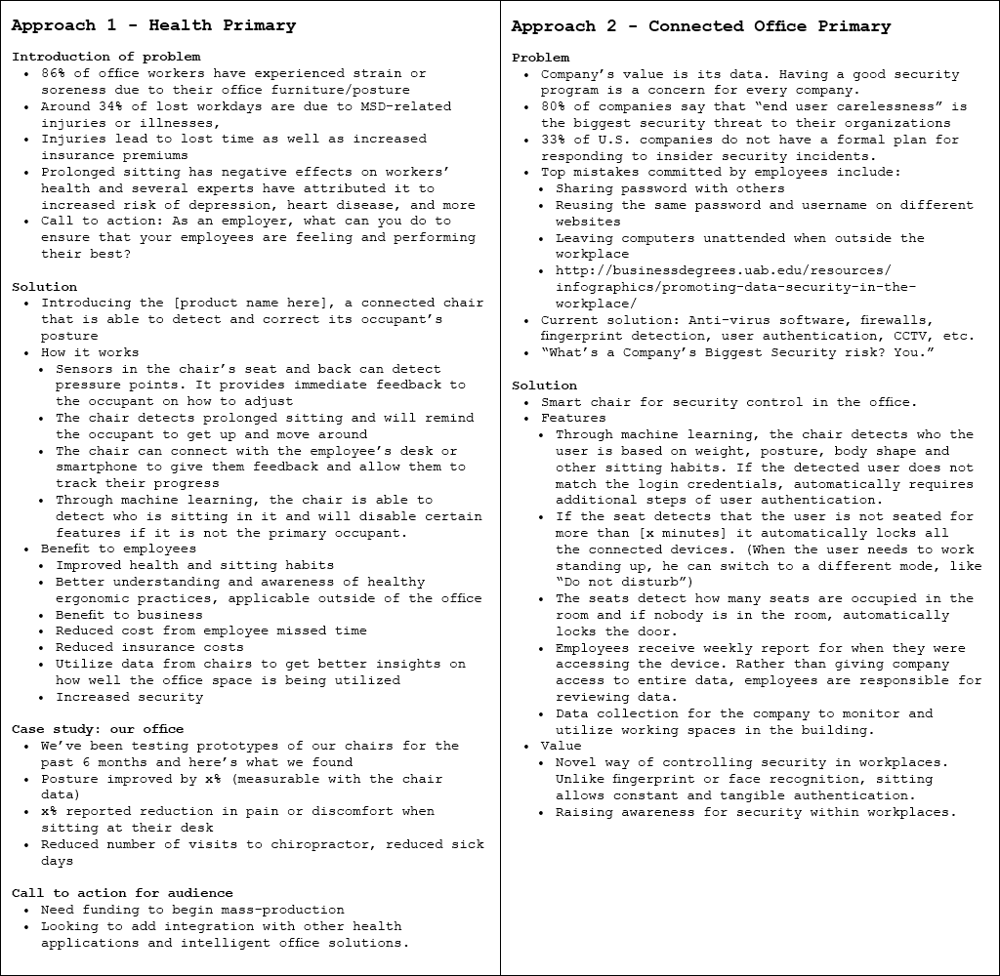
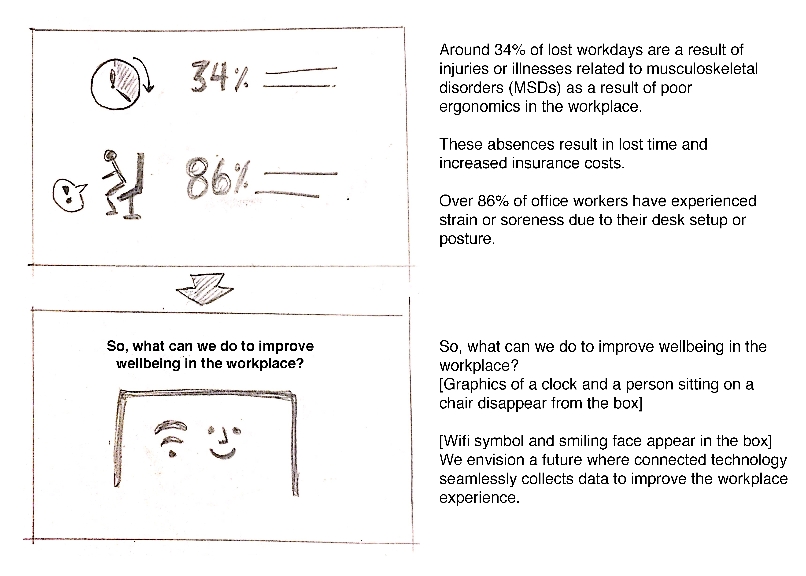
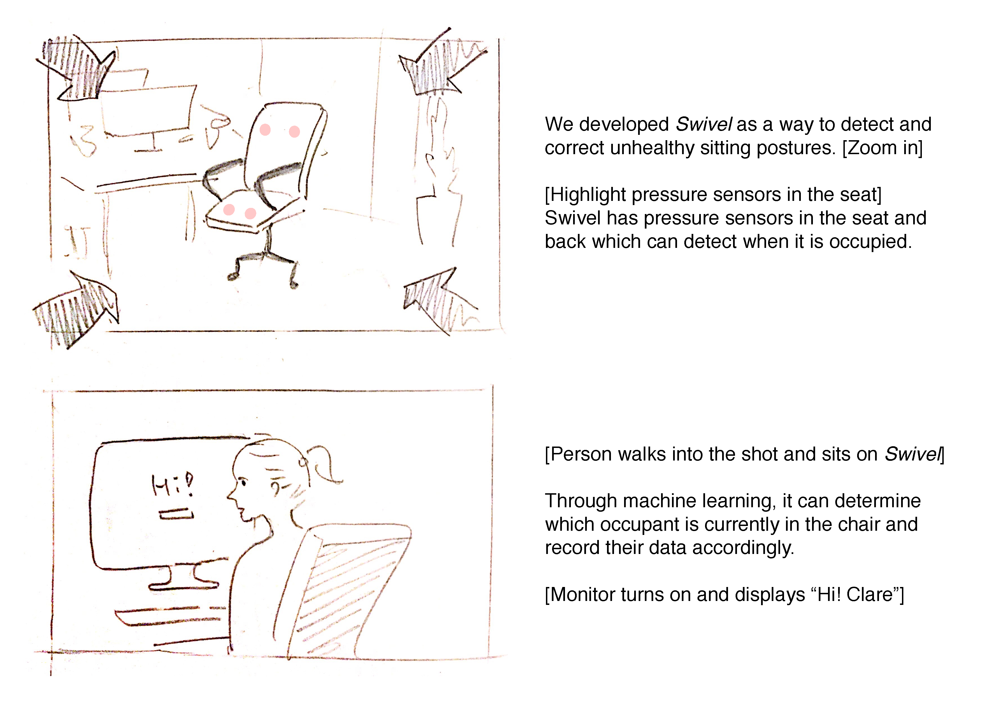
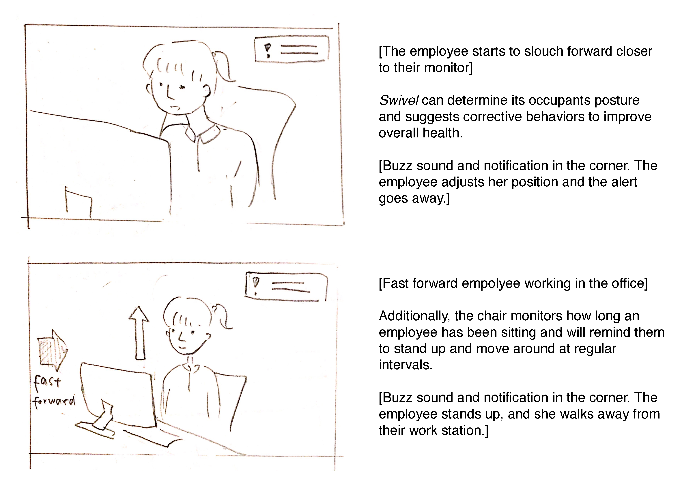
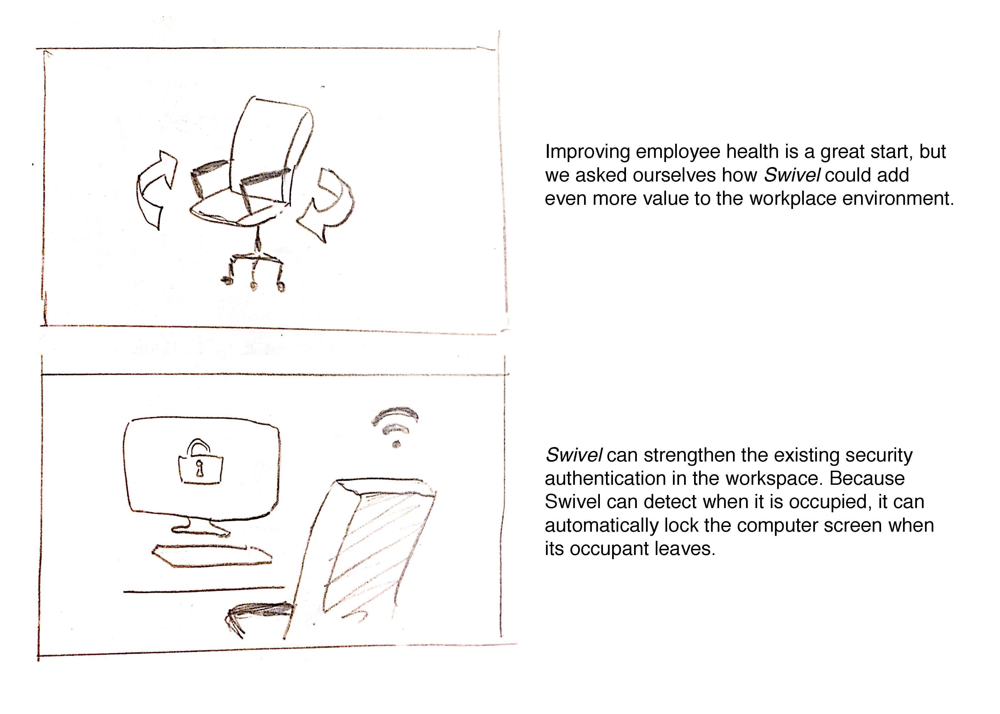
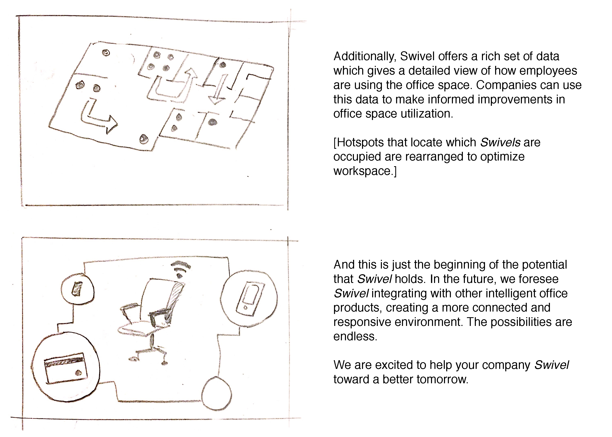

<h3>Final Product</h3>

<!--<iframe src="https://player.vimeo.com/video/196141320" frameborder="0" webkitallowfullscreen mozallowfullscreen allowfullscreen></iframe>-->

<h3>Executive Summary</h3>

For the final assignment in the Interaction Design Studio class at Carnegie Mellon University, I worked on a team to conceptualize an application for an existing Internet of Things device and create a two-minute film demonstrating how it would hypothetically work.

Our concept is Swivel, a connected office chair that uses weight sensors in the seat and back. With these sensors, the chair can determine when it is occupied, who is occupying it, and can provide real-time feedback regarding the occupant’s posture.

Swivel fulfills several needs in commercial office spaces, where poor ergonomics harmfully impacts employee health and productivity. Additionally, it provides a rich set of data which employers can use to make their office space more intelligent and adaptive.

<h3>Ideation</h3>

We were given five technologies to explore: a camera ID with sensor, a connected scale, an inventory bag, micro location, and mixed reality. We discarded mixed reality because one team member already had extensive experience with it and wished to explore something new.

We started by brainstorming a few ideas individually and then getting together as a group to discuss our ideas for each.

After brainstorming, we considered the tradeoffs of each idea and focused on ones that we thought had the most potential. We eventually narrowed down to two ideas: an inventory-sensing medical kit and a weight-sensing office chair. We selected the office chair because we thought it had wider potential applications and a richer set of data.

<h3>Research and Idea Refinement</h3>

We envisioned the weight-sensing chair as a health-oriented solution, augmenting existing health wearables to help occupants take action to improve their health. It could inform occupants when their posture is not healthy or when they should get up and move around, both of which are important for good health.

We identified businesses, particularly tech companies, as an ideal target customer for the weight sensing chair because they already invest heavily in ergonomic solutions for their employees, and with good reason. Some team members, including me, have experienced injuries due to poor ergonomic practices at work. These injuries negatively impacted our productivity and required several costly doctor’s visits to fix. If such injuries occur widely throughout a company, its medical insurance costs would rise. With this approximate knowledge of the problem, we sought out concrete data to support or refute the current dire state of ergonomics, verifying the need for our solution.

Our research findings confirmed what we suspected. Over 86% of office workers have experienced strain or soreness due to their desk setup or posture, resulting in injuries and illnesses that account for around 34% of lost workdays [2]. For companies, this costs around 45 to 54 billion dollars of lost compensation, wages, and productivity every year [3].

As we were conducting our research around ergonomics in the workplace, we encountered several products aimed towards addressing both the concerns of poor posture and infrequent breaks from sitting.

The major breakdown with these current devices is that they are not always accurate or convenient to use. For example, gesturing energetically can trick wearables such as the FitBit or Apple Watch into thinking their wearer is standing or moving. Another example is the LumoLift [1], a device which requires users to pin it onto their clothes in order to receive real-time feedback on their posture. This may not be very stylish and provides no value if the user forgets to put it on. Having a sensor in the chair is more seamless for the user and also reduces the likelihood of the device falsely thinking the user has stood up.

Another opportunity to make the connected chair stand more valuable than its competition is the potential for data. If all of the chairs in an office are able to track when they were occupied, this could allow companies to get a clear picture of how employees utilize their office space. This is increasingly important for companies as they must make decisions about how to restructure office spaces or identify areas they can repurpose or eliminated.

Currently companies either do not have utilization data or the utilization data can only indicate whether a whole room or area is occupied without knowing precisely how many people were occupying it. Because each chair can tell when it is occupied, Swivel can precisely count how many people used a room at any given time. One potential issue we saw with this is that office chairs move around frequently and they may quickly drift away from their starting location. A potential solution to address this problem would be to have each chair equipped with Bluetooth and measure the signals of the surrounding chairs to determine its relative location.

In addition to providing information on space utilization, we also realized that if the chair could learn who was sitting on it, it could load up an occupant’s personal desktop as soon as they sit down. This would be useful for security authentication in a flexible office environment. Additionally, the chair could lock the computer screen after becoming unoccupied, which would reduce the security risk of unattended workstations.

As we continued to explore how the weight sensing chair could be useful in aspects of the office space beyond ergonomics, we considered making ergonomics secondary to the connected office potential. We thought both approaches could be equally interesting and wrote an outline and partial draft for each.

Upon reviewing approaches, we decided that the case for health being the primary benefit was still the strongest. However, we did not entirely eliminate the connected office capabilities from the script as we thought they showcased the multifaceted value of this product. As we fleshed out the script, we picked a product name to avoid having a placeholder. After brainstorming a few options, we selected the name “Swivel”.

<h3>First Draft of Script (with Storyboards)</h3>

<h3>Final Touches</h3>

After finalizing our film shots, we added the final polish to our footage by creating a consistent style.

We needed several icons throughout the film, all of which we developed ourselves in Adobe Illustrator.

<!--<h3>References</h3>
<ol>
    <li><a href="http://www.lumobodytech.com/">http://www.lumobodytech.com/</a></li>
    <li><a href="http://hub.staplesadvantage.com/h/i/218389662-put-your-back-into-it-11-ergonomics-stats">http://hub.staplesadvantage.com/h/i/218389662-put-your-back-into-it-11-ergonomics-stats</a></li>
    <li><a href="http://www.cdc.gov/workplacehealthpromotion/health-strategies/musculoskeletal-disorders/evaluation-measures/index.html">http://www.cdc.gov/workplacehealthpromotion/health-strategies/musculoskeletal-disorders/evaluation-measures/index.html</a></li>
</ol>-->

<h3>Resources</h3>
Music: <a href="https://www.youtube.com/watch?v=pZD66AVzQRY">Inspirational, Promo Presentation Music (Royalty Free) - Music by Marcus</a>
Software: Premiere Pro, After Effects, Illustrator, Adobe Color CC, palettable.io