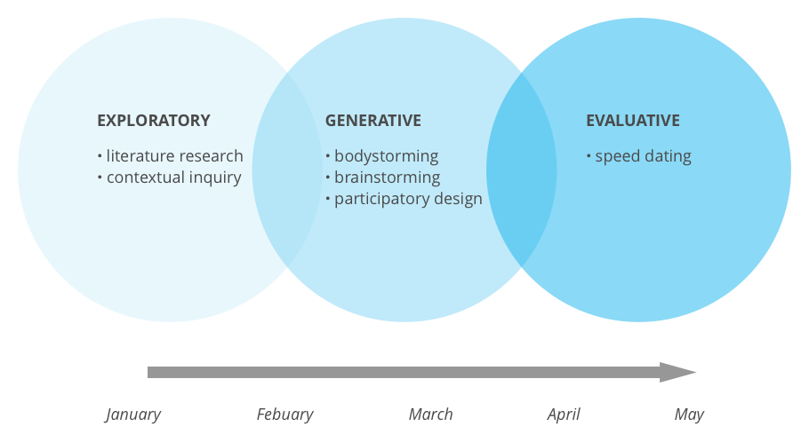

<!--<h3>About the Client</h3>

Deloitte Digital is a globally located digital consulting firm that works with a broad spectrum of clients, including various law enforcement agencies in the Unites States government.
-->

<h3>About the Project</h3>

For the MHCI capstone project, my team has been working with Deloitte Digital to identify opportunities for emerging technologies to <b>increase the effectiveness and safety of law enforcement</b>, both for officers and the citizens whom they protect and serve.

<h3>Our Process</h3>

For the duration of the spring semester (January through May 2017), our team has been focusing on conducting research to understand the law enforcement domain, scope down on opportunities the research suggests are promising, and begin early stages of ideation. As such, we have divided our research up into 3 phases.

As project manager and research co-lead, my role on the team has been focused both on ensuring that our research progresses in the right direction at a reasonable pace, communicating insights to our client and other stakeholders, and going out into the field interviewing various participants.

<h3>In Progress – Come Back Soon!</h3>

This project is still a work in progress. Come back to see more insights from our research and even possibly some early prototypes.
