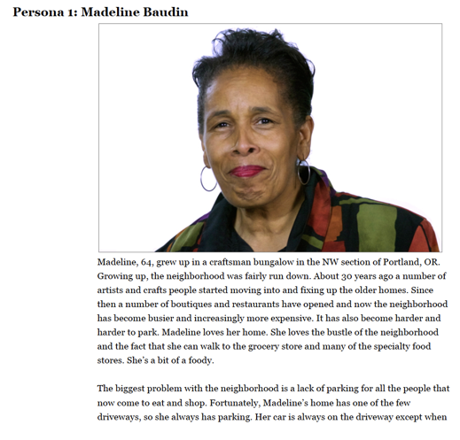

    <h1>Need</h1>
    
Parking is expensive and difficult to find, yet <a href="http://freakonomics.com/podcast/parking-is-hell-a-new-freakonomics-radio-podcast/">some sources</a> indicate that around 3 parking spaces exist for every car.

    
How can a resource seem scarce, yet actually be so abundant?

    
One contributing factor is that some spaces can only be utilized by a specific person, like a driveway at someone’s house. When the homeowner is away, their driveway is unoccupied, making it an unutilized resource. Is it possible to make these exclusive resources available to others when their primary owner is not using them? And why doesn’t this happen now? One contributing factor is that there is a mutual lack of trust between the person with the driveway and the person looking for parking.

    <h1>Solution</h1>
    
MeterMaid is a mobile application that enables homeowners to capitalize upon their open driveway space by connecting with drivers seeking convenient and affordable parking. We designed it specifically to <b>facilitate trust</b> between the two parties, particularly on the homeowner’s side by enabling them to monitor their property in the application, report inappropriate or malicious behavior, and filter out and block certain users.

    <h1>Process</h1>
    

    

    <h2>Personas</h2>
        
At the beginning of the project, we received two personas: one for the person who wants to make money off of their unoccupied driveway and another who is looking for more affordable parking.

        

            

            

        

    

    
    

        

        <h2>Ecosystem Collection</h2>
        
After examining the personas and problem statement, we conducted an Ecosystem Collection where we discussed what we know about the parking domain, discussed what we don’t know, and defined the critical questions to explore.

        
        
From the ecosystem collection, we determined that we should focus on understanding what the current experience is for people looking for parking as well as understanding the factors that go into successful crowd-sharing platforms such as Uber, AirBnB, and eBay, particularly how they build trust between their users.

        
With this goal in mind, we specified several research objectives:

        <ol>
            <li>To gain a more complete understanding of the context in which people look for parking and what they prioritize (proximity, cost, etc.).</li>
            <li>To understand the existing choices for parking and how they operate.</li>
            <li>To understand the trust mechanics of existing resource sharing services (e.g. AirBnB, Uber) and to understand what led current users to trust these services.</li>
        </ol>
    

    
    

        

        <h2>Survey</h2>
        
To address the first two research objectives, we developed a short survey on Google Forms and distributed it on social media. Respondents answered questions such as how frequently they use public parking, what is important to them when finding parking, and how long it took them to find a spot to park in the last time they used public parking.

        
        

        
We distributed the survey to our social networks and received 23 responses in total. After reviewing the results, we noticed a few interesting patterns:

        <ul class="portfolio-body-list">
            <li>Several respondents remarked that it is currently very difficult to find available parking and to know the price of parking in advance when using navigation applications such as Google Maps.</li>
            <li>Of the people who took the survey, most indicated that <b>safety is the most important aspect</b> when considering parking, followed by availability/ease of parking. Surprisingly, they said <b>price was the least important</b>, which contradicts the information from our personas (Rebecca doesn’t want to pay the high fees for parking her car in a lot near the hospital) as well as what the <a href="http://freakonomics.com/podcast/parking-is-hell-a-new-freakonomics-radio-podcast/">Freakonomics podcast</a> indicated, where people in will spend more time driving around looking for a spot that they do not have to pay for.</li>
        </ul>
        
        
Most participants seem to rank availability and safety of parking over affordability.

    

    
    

        

        <h2>Interviews</h2>
        
To address the second research objective of understanding existing choices for parking, we explored the various parking options in Pittsburgh and reached out to several landlords who handle parking. Of the individuals we reached out to, only one responded. We visited that one person and conducted a brief one-hour interview.

        
The parking lot manager we interviewed manages a space with both public and lease parking. One of her biggest challenges include maintaining a good level of public parkers to optimize revenue while also guaranteeing any leaseholder is able to find parking. Another challenge is being unable to contact public parkers who have unknowingly parked in an off-limits space; often she has to have their car towed as a result.

    

    

        

        <h2>Literature Review & Analogous Domain Analysis</h2>
        
Regarding the third research objective of how other resource-sharing services build trust between users, we conducted a literature review and conducted informal interviews with Uber drivers. While riding in an Uber around the city, we had a casual conversation with our drivers about what  incentivized them to get started and how Uber protects them and their assets.

        
From this, we had several interesting findings:

        <ul class="portfolio-body-list">
            <li>A positive first experience with the application - On AirBnB, if a host cancelled their reservation right before their trip, their retention rate drops 26%; intervention by customer support almost entirely negates this loss — retention rebounds up from 26% to less than 6%. (http://airbnb.design/designing-for-trust/)</li>
            <li>Ratings System - On AirBnB, hosts with ten or more ratings are ten times more likely to get booked.</li>
            <li>Trustworthy profile page - In nearly 50% of trips with AirBnB, guests view a host’s profile at least once, and 68% of these views occur before booking. These profiles are especially important for new Airbnb users, who are 20% more likely to visit a host’s profile before booking compared to someone who has used AirBnB before.</li>
            <li>Good support system from the application - Most of the Uber drivers that we interviewed said that they were trusting of the Uber/Lyft Model because they knew that if something went wrong, Uber would mediate and take care of the situation</li>
            <li>Some ridesharing applications provide more support for drivers than others. For example, before a driver can begin taking passengers using Lyft, a representative comes to their home to verify their information, confirm that their vehicle is up to code, and assists the driver in setting up a profile. Uber takes a more hands-off approach, requiring drivers to register through the app while offering very little support.</li>
        </ul>
    

    

        

        <h2>Exploratory Scenarios</h2>
        
After wrapping up our research, we starting conceptualizing some initial scenarios and ideas for MeterMaid. We wanted to address users’ needs of trust and make sure that we were building the best possible experience for both personas.

        
When writing our initial scenarios, we paid special attention to edge cases, such as bad behavior from the driveway owner and the parker, to ensure that our application could handle critical moments where our users might lose trust. Questions we asked ourselves included:

        <ul class="portfolio-body-list">
            <li>What happens when drivers do not come back for their car on time?</li>
            <li>How does a user book parking? Is it on demand? Are users allowed to schedule times for their bookings?</li>
            <li>How does a driveway owner cancel booking?</li>
            <li>How does a driveway owner handle harassment?</li>
            <li>How does the service handle different sized driveways?</li>
            <li>What security measures are in place to make sure that people do not use this service for robbing houses?</li>
        </ul>
        
    

    

        

        <h2>Storyboarding</h2>
        
We started with 21 initial scenarios. From those 21, we picked 3 to flesh out and explore with storyboards. The purpose of these storyboards was to help us understand the contexts in which users might be performing actions as well as the order in which they would take those actions.

        
I focused on the storyboards pictured below, which depict the ideal case for how someone loaning out their driveway might use the application on a daily basis.

        
    

    

        

        <h2>Wireframe Sketches</h2>
        
After making several storyboards depicting the several uses of MeterMaid, we started making wireframes for the application, focusing on the experience for the person renting out their driveway.

        
We initially decided to break the application’s functionality down into five main components: scheduling, earnings, history, profile editing, and settings. The driveway owner should get an overview of everything that has happened in a main landing page.

        
I focused on creating sketches for the earnings and history feature. When doing these initial sketches, I wanted to give the owner a clear understanding of how much income they are making off of their participation in the service. I thought this would be important for their budgeting and also for <b>communicating the value</b> they get out of participating in the service.

        
        
I did several initial sketches, exploring different options for visualizing the information (bar chart versus line chart) and the details users can navigate. The application should have a good balance of simplicity and useful information.

        
The history page was more straightforward. The owner should be able to see a comprehensive list of who parked in her driveway and for how long. She should also be able to see more information about the parker and report any inappropriate behavior.

        
        
After meeting as a team to review each component of the application, we proceeded to digitize our wireframes and create higher-fidelity screens, which we presented to the class for feedback.

        
    

    

        

        <h2>Feedback, Modifications, and Final Touches</h2>
        
When we presented our application concept to the class, the biggest point of feedback we received was that it might be helpful to add more functionality to <b>support trust</b> for the driveway owner.

        
We considered this feedback and decided to add a feature where the driveway owner can check in on their property by viewing a live feed. We theorized that the MeterMaid service could provide the installation of such equipment for the driveway owner, possibly in partnership with an existing security company. Much like existing resource sharing applications like Lyft, this would require someone from the company to physically go to the owner to both install the equipment and ensure that the property fits the service standards.

        
After agreeing to add this concept, we made adjustments to the driveway owner’s screens. We placed the button to view the live feed very prominently so it would be easy for owners to check.

        

        
Finally, we added some animations using <a href="http://principleformac.com/">Principle</a> to better simulate the interactivity of the application and add aspects of joy. I worked with one of my teammates to create the animation for when the graphs first load in the application.

        

            

            

        

        
We combined these animations with our concept screens to create the final <a href="https://invis.io/C69BWXR45">click-through inVision prototype</a>.

    

    <h1>Next Steps</h1>
    
This was a four-week project where we rapidly went from research to a fleshed out prototype. There were steps we could take to validate our design decisions that we did not have the time or the resources to pursue.

    
For example, when designing an application concept, it is a good idea to conduct usability tests with target users along the way, both to validate that the design is something they would use and that it is something they would understand.

    
If we were to conduct more tests to vet our designs, the next step would be to make adjustments based off of feedback and then go into development.

