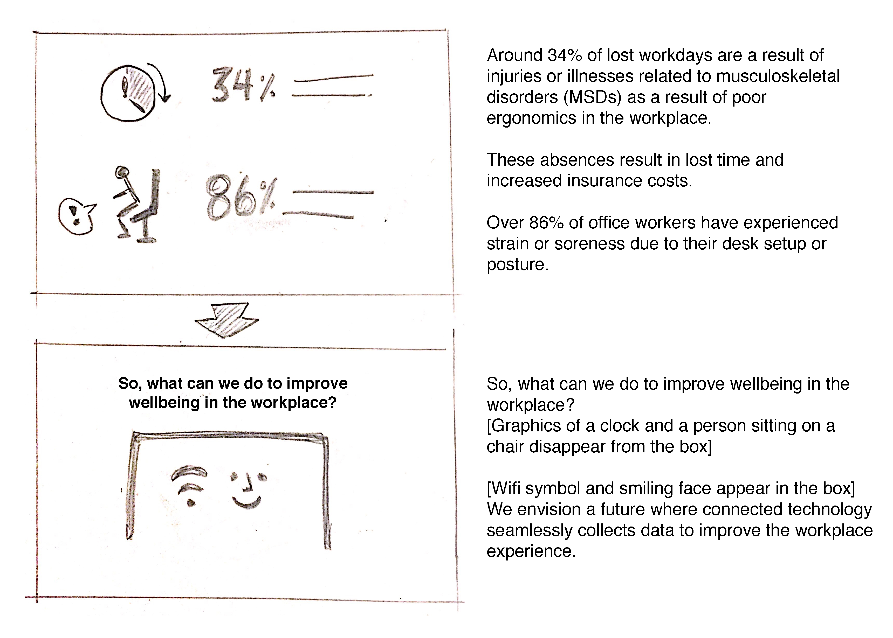
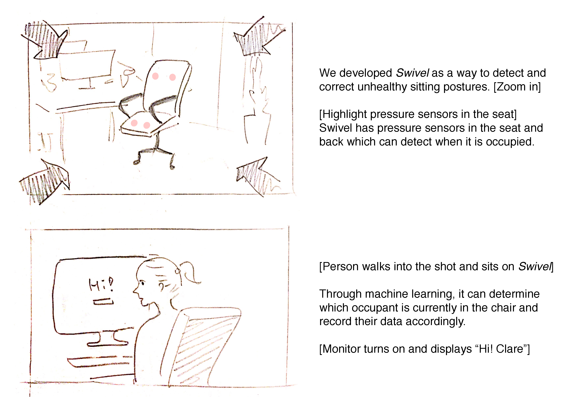
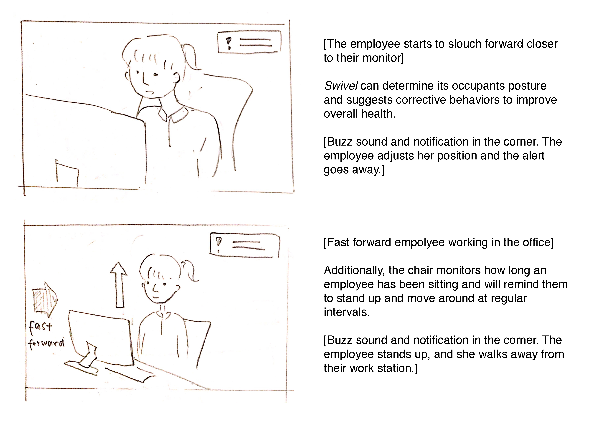
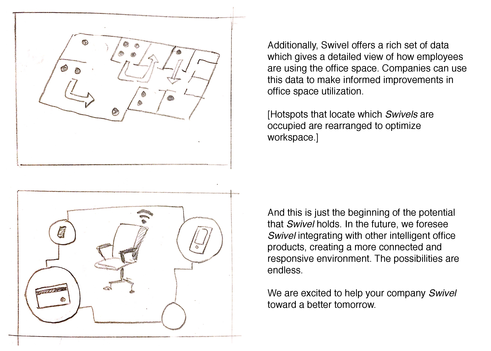

    <h2>the need</h2>
    
Over 86% of office workers have experienced strain or soreness due to their desk setup or posture, resulting in injuries and illnesses that account for around 34% of lost workdays. For companies, this costs around 45 to 54 billion dollars of lost compensation, wages, and productivity every year.

    
Good ergonomic practices, especially proper sitting posture and desk setup, can prevent these musculoskeletal injuries. Is it possible that technology could help people gain better ergonomic practices by giving them real-time feedback on the healthiness of their posture?

    <h2>the solution</h2>
    
Our concept is Swivel, a connected office chair that uses weight sensors in the seat and back. With these sensors, the chair can determine when it is occupied, know who is occupying it, and give the occupant real-time feedback on their posture.

    
We conceptualized Swivel as a solution not only for helping to improve employees’ health and productivity in the workplace, but also as a source of data for employers. Employers could use information from Swivel to better understand how employees utilize the office space, helping them to make better decisions about office layout.

    <h2>the process</h2>
    

        <h3>Ideation</h3>
        
We were given five technologies to explore: a camera ID with sensor, a connected scale, an inventory bag, micro location, and mixed reality. We discarded mixed reality because one team member already had extensive experience with it and wished to explore something new.

        
We started by brainstorming a few ideas individually and then getting together as a group to discuss our ideas for each.

        
        

        
        
After brainstorming, we considered the tradeoffs of each idea and focused on ones that we thought had the most potential. We eventually narrowed down to two ideas: an inventory-sensing medical kit and a weight-sensing office chair. We selected the office chair because we thought it had wider potential applications and a richer set of data.

    

    

        <h3>Research and Idea Validation</h3>
        
We envisioned the weight-sensing chair as a health-oriented solution, augmenting existing health wearables to help occupants take action to improve their health. It could warn occupants when their posture is not healthy and remind them to get up and move around, both of which are important for good health.

        
We identified businesses, particularly tech companies, as an ideal target customer for the weight sensing chair because they already invest heavily in ergonomic solutions for their employees, and with good reason. Some team members, including me, have experienced injuries due to poor ergonomic practices in the workplace. These injuries negatively impacted our productivity and required several costly doctor’s visits to fix. If such injuries occur widely throughout a company, it might experience productivity issues and increased medical insurance expenses. With this approximate knowledge of the problem, we sought out concrete data to support or refute our understanding of the current state of ergonomics.

        
Our research findings confirmed what we suspected. Over 86% of office workers have experienced strain or soreness due to their desk setup or posture, resulting in injuries and illnesses that account for around 34% of lost workdays. For companies, this costs around 45 to 54 billion dollars of lost compensation, wages, and productivity every year.

    

    

        <h3>Competitive Analysis & Opportunities</h3>
        
As we were conducting our research around ergonomics in the workplace, we encountered several products aimed towards addressing both the concerns of poor posture and infrequent breaks from sitting.

        
        
Icons made by <a href="http://www.freepik.com" title="Freepik">Freepik</a> from <a href="http://www.flaticon.com" title="Flaticon">www.flaticon.com</a> is licensed by <a href="http://creativecommons.org/licenses/by/3.0/" title="Creative Commons BY 3.0" target="_blank">CC 3.0 BY</a>

        

        
The major breakdown with these current devices is that <b>they are not always accurate or convenient to use</b>. Because Swivel is embedded in the chair, it can more accurately tell whether it is occupied or not without requiring its occupant to remember any additional devices.

        
Another opportunity to make the connected chair stand more valuable than its competition is the potential for data. If all of the chairs in an office are able to track when they were occupied, this could allow companies to get a clear picture of how employees utilize their office space. This is increasingly important for companies as they must make decisions about how to restructure office spaces or identify areas they can repurpose or eliminated.

        
Currently companies either do not have utilization data or the utilization data can only indicate whether a whole room or area is occupied without knowing precisely how many people were occupying it. Swivel fulfills this need because each chair can tell when it is occupied, which precisely count how many people used a room at any given time.

        
One potential issue we saw with this is that office chairs move around frequently and they may quickly drift away from their starting location. A potential solution to address this problem would be equipping each chair with Bluetooth and measure the signals of the surrounding chairs to determine its relative location.

        
In addition to providing information on space utilization, we also realized that the chair had potential security applications as well. If it could learn who was sitting on it, it could load up an occupant’s personal desktop as soon as they sit down. Additionally, the chair could lock the computer screen after becoming unoccupied, which would reduce the security risk of unattended workstations.

    

    
    

        <h3>Focus of Pitch</h3>
        
As we continued to explore how the weight sensing chair could be useful in aspects of the office space beyond ergonomics, we considered making ergonomics secondary to the connected office potential. We thought both approaches could be equally interesting and wrote an outline and partial draft for each.

        
        
Upon reviewing approaches, we decided that the case for health being the primary benefit was still the strongest. However, we did not entirely eliminate the connected office capabilities from the script as we thought they showcased the multifaceted value of this product. As we fleshed out the script, we picked a product name to avoid having a placeholder. After brainstorming a few options, we selected the name “Swivel”.

    

    

        <h3>First Draft of Script (with Storyboards)</h3>
        
        
        
        
        
    

    

        <h3>Final Touches</h3>
        <!--
<b>Colors</b>
-->
        
After finalizing our film shots, we added the final polish to our footage by creating a consistent style.

        
We started by exploring several color palettes using Adobe CC. Originally, we wanted colors with a very cool, professional tone to reflect the office setting and coloring of the chair.

        
        &nbsp;
        
We found that these did not add enough contrast, particularly for the text at the beginning of the video. We explored two themes with brighter colors.

        &nbsp;
        
        &nbsp;
        
We selected the bottom set of colors because they gave everything a warmer feel, which made our video seem friendlier.

        
After finalizing the color palette for the product and video, we created several icons which we needed for the video. I created a variety of options for each icon in Adobe Illustrator and presented them to the rest of the team. Together, we selected the icons we thought looked best.

        
    

    <h2>next steps</h2>
    
This was a concept that we developed over the course of 3 and a half weeks. Due to the short timeline and the two-and-a-half time limit on the final video, we limited our scope to focus on the essentials of our concept. If we were to further develop the concept, we might do the following:

    <h3>Application for Employees</h3>
    
We showed this briefly in the video, but there is an opportunity to specify how employees might adjust Swivel’s behavior to suit their needs or how employees could visualize their information from Swivel.

    <h3>Application for Employers</h3>
    
As understanding office utilization is one of the key values that Swivel provides, it would be useful to provide an application where employers can both configure their Swivel chairs and also visualize the information from Swivel. The most important problem with this aspect of the problem would be to find the right balance of insightful information for the employer while protecting employee privacy.

    <h3>Integration with Other Office Technology</h3>
    
As mentioned in the video, there is a lot of potential to integrate Swivel with other technologies within an office space, particularly lighting, HVAC, and security systems.

    <h2>final thoughts</h2>
    
Swivel is perhaps one of the most unique and unconventional projects I have done to date, both in terms of the process I followed and the solution I created.

    
Typically, I am used to starting with a problem space and then finding the best solution to fit that problem space. In this project, however, we already had the basic component of the solution and needed to find the problem space it could have the best impact upon. This shifted our focus to identifying a problem instead of identifying the solution. Although this may not be as common in practice, it could be useful for helping a business identify applications for a technical concept.

    
This is also the first time I conceptualized a non-GUI solution. While I have worked on systems that incorporate hardware during <a href="2016-07-01-quantum-vue.md">my tenure at Lutron</a>, this was the first time I was focused on defining the uses and capabilities of the hardware (in the form of the chair). The rise of technologies like conversational user interfaces, augmented or virtual realities, and Internet of Things objects requires user experience designers to think beyond graphical interfaces so this was valuable practice for me both for conceptualizing a hardware solution and for communicating concepts through a digital medium.

<!--<h2>References</h2>
<ol>
    <li><a href="http://www.lumobodytech.com/">http://www.lumobodytech.com/</a></li>
    <li><a href="http://hub.staplesadvantage.com/h/i/218389662-put-your-back-into-it-11-ergonomics-stats">http://hub.staplesadvantage.com/h/i/218389662-put-your-back-into-it-11-ergonomics-stats</a></li>
    <li><a href="http://www.cdc.gov/workplacehealthpromotion/health-strategies/musculoskeletal-disorders/evaluation-measures/index.html">http://www.cdc.gov/workplacehealthpromotion/health-strategies/musculoskeletal-disorders/evaluation-measures/index.html</a></li>
</ol>-->

    <h2>resources</h2>
    
Music: <a href="https://www.youtube.com/watch?v=pZD66AVzQRY">Inspirational, Promo Presentation Music (Royalty Free) - Music by Marcus</a> 
    Software: Premiere Pro, After Effects, Illustrator, Adobe Color CC, palettable.io

