<!--team: 5 people
duration: 8 months
role: Project Manager & Research Co-Lead-->

<!--<h3>About the Client</h3>

Deloitte Digital is a globally located digital consulting firm that works with a broad spectrum of clients, including various law enforcement agencies in the Unites States government.
-->

    <h2>the need</h2>
    
In most agencies around the U.S., officers and detectives respond to multiple calls a day and are often pressed for time when responding to events. They count on limited time - often just minutes - to gather all the relevant information to solve cases.

    
The current tools that officers have access to in the field lead to several issues when capturing information in the field, including:

    <ol>
        <li>Gathering people’s information in the field is tedious and error-prone</li>
        <li>Language barriers obstruct understanding</li>
        <li>Handwritten notes lose detail</li>
        <li>Taking notes is painful but essential</li>
        <li>Officers dread writing reports</li>
    </ol>

    <h2>the solution</h2>
    
We utilized insights from months of in-depth research to design Vivid, a concept for a mobile application to enable police officers to capture information on a scene with greater speed, accuracy, and detail.

    
Vivid has 5 key features, each of which addresses a specific need:

    <ol>
        <li>Collect witness and victim information by scanning important documents</li>
        <li>Support interactions with non-English speakers</li>
        <li>Capture scene details as multimedia information</li>
        <li>Take notes digitally</li>
        <li>Speed up reporting process</li>
    </ol>
    
Go <a href="http://mhci2.andrew.cmu.edu/solution.html">here</a> to see how each feature works.

    <h2>the process</h2>
    
We spent 4 months applying user-centered design principles to understand the domain of law enforcement and identify opportunities. We applied our research insights to prototype and iteratively test concepts.

    

        <h3>Project Kickoff</h3>
        
At the beginning of our project, we met with our client to understand what they already know about law enforcement and identify interesting opportunities to focus on.

        

            

            

                <!--

-->
                    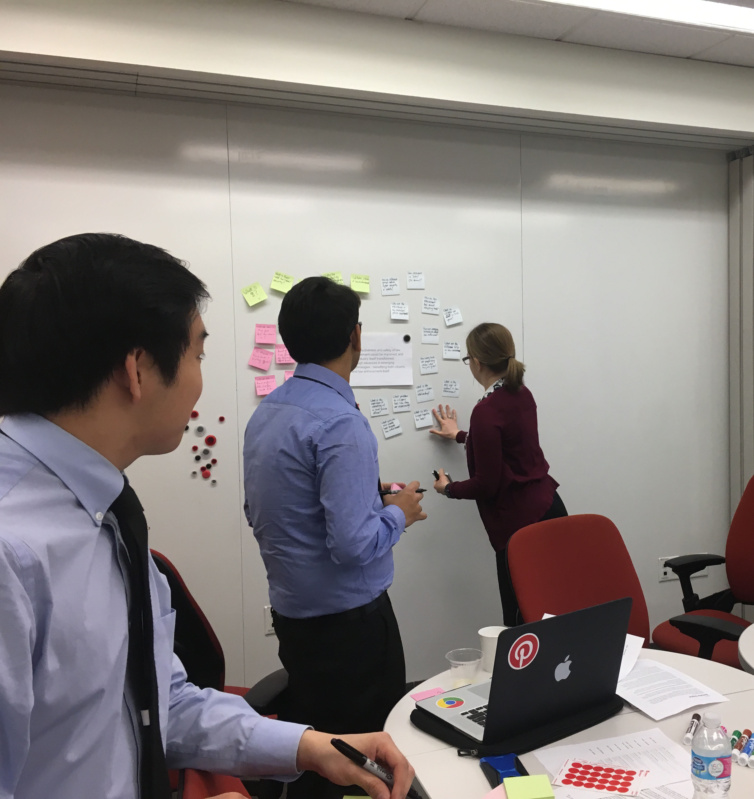
                
  
                

                    <!--

-->
                    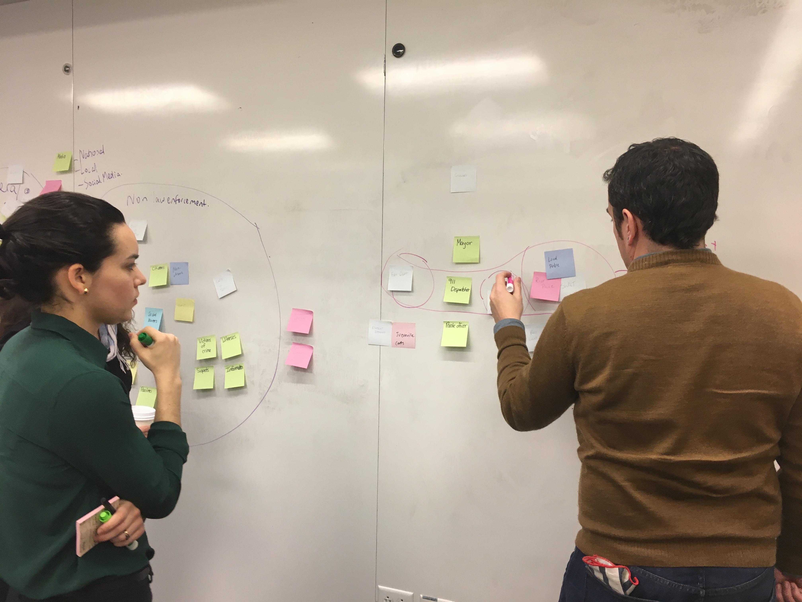
                

            

            
We conducted various exercises with the client, including question storming, stakeholder mapping, and territory mapping.

        

        

            <!--

-->
            

                

                    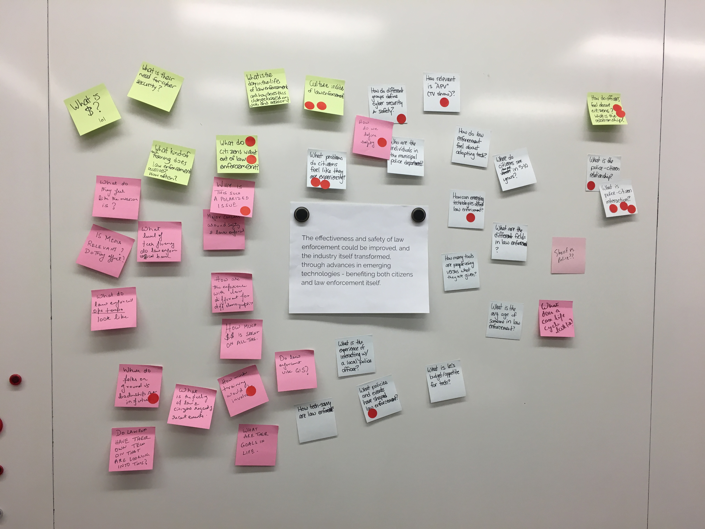
                

            

            
We used <b>question storming</b> to identify what both the team and the client were interested in learning about law enforcement.

        

        

            

            <!-- TODO: make the height equal on these images -->
                

                    <!--

-->
                    
                

                

                    <!--

-->
                    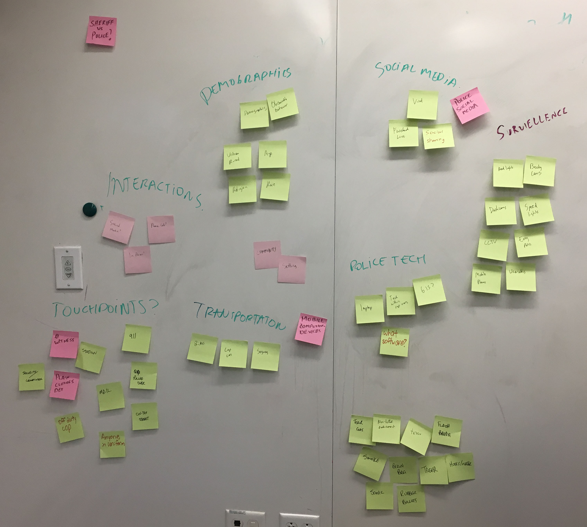
                

            

            
We used <b>stakeholder mapping</b> and <b>territory mapping</b> to share our existing knowledge of the law enforcement domain and identify gaps in knowledge.

        

    

    

        <h3>Scope Definition</h3>
        
Based off of what we learned from our kickoff meeting, we identified two key themes for our initial research: understanding how law enforcement operates in the field and interacts with members of the public.

        
We used these two themes to define the hunt statement to guide our initial research.

        

            

                <h4 class="centered-text">HUNT STATEMENT</h4>
                
We are going to research the <b>day in the life of a police officer</b>, focusing on <b>touchpoints with members of the public</b>, so that we can identify opportunities to <b>improve law enforcements’ effectiveness</b> and <b>make situations safer</b> for officers and citizens alike.

            

        

    

    

        <h3>Interviews & Interpretation</h3>
        
To understand how law enforcement operates today, we interviewed a broad range of stakeholders, including  police, emergency responders, and members of the public.

        

            

                <h4 class="centered-text">PARTICIPANTS OVERVIEW</h4>
                

                    

                        
5

                        
Local law enforcement agents

                    

                    

                        
5

                        
Federal law enforcement agents

                    

                    

                        
4

                        
Emergency planning officials

                    

                

                

                    

                        
1

                        
Community policing volunteer

                    

                    

                        
1

                        
Criminal justice expert

                    

                    

                        
1

                        
Criminal data analyst

                    

                

            

        

        

            

                

                    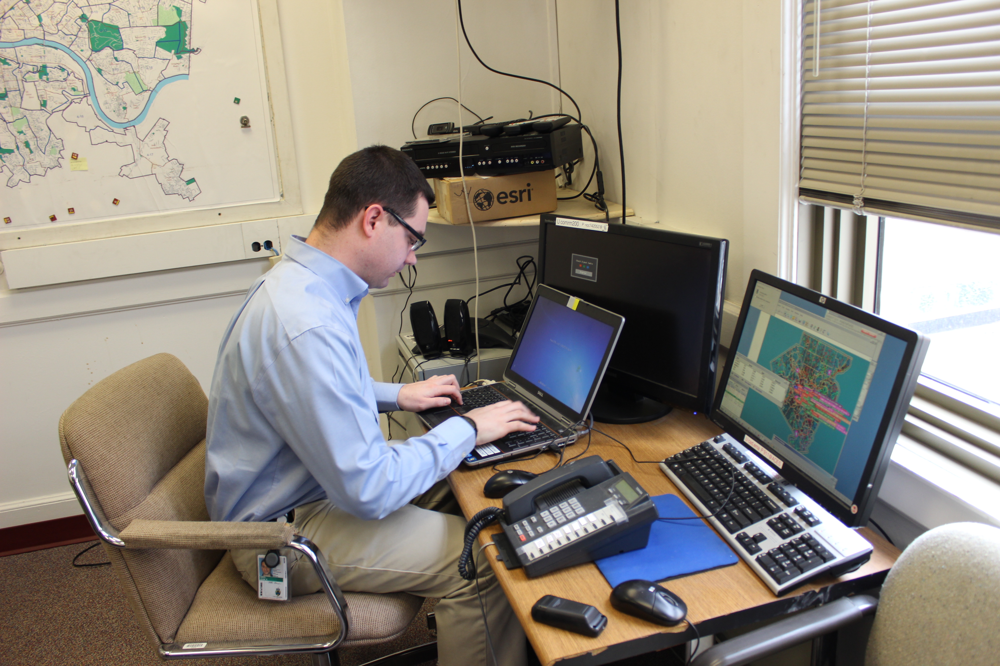
                

            

            <!--

-->
            
We <b>interviewed</b> participants <b>in the context of their work environment</b> to better understand their attitudes and behaviors.

        

        

            <!--

-->
            

                

                    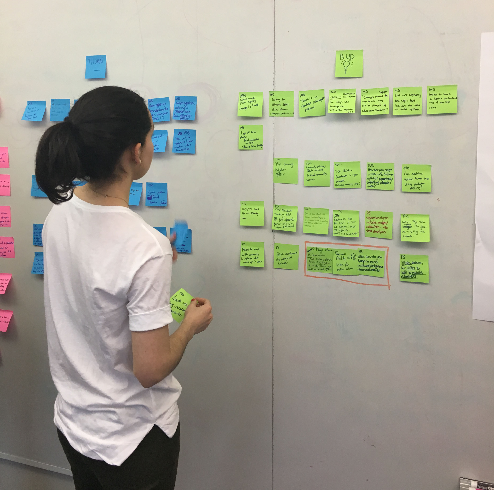
                

            

            
We used the <b>rose-bud-thorn</b> method to draw out important insights from each interview.

        

        

            

                

                    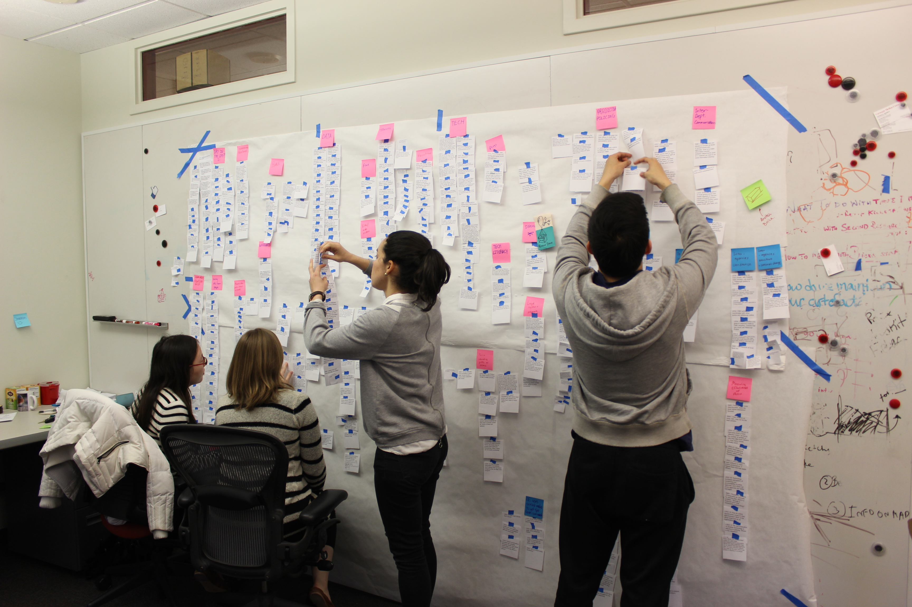
                

            

            <!--

-->
            
In order to identify common themes from our interviews and literature research, we created an <b>affinity wall</b>.

        

        

            

                

                    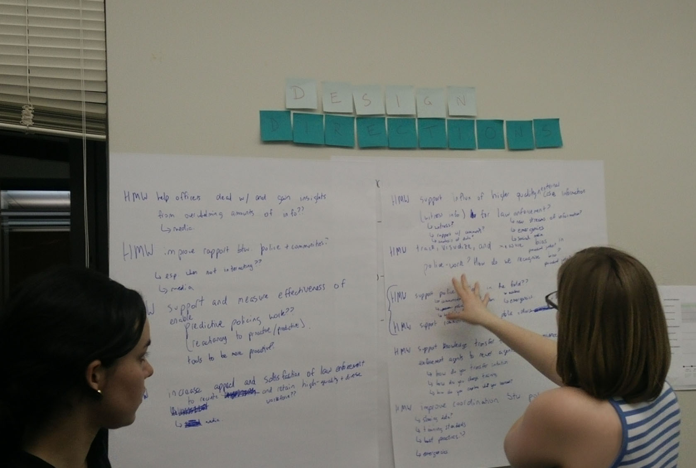
                

            

            <!--

-->
            
We brainstormed several more specific design directions based off of the overarching themes from our affinity wall.

        

    

    

        <h3>Insights & Opportunities</h3>
        
We compiled the key research insights and design opportunities from our research and presented them to our client.

        

            

                <h4 class="centered-text">INSIGHTS</h4>
                <h5>1 – Reliance on community relationship</h5>
                
Increased transparency from law enforcement could help communities gain a better understanding of the police and build trust and rapport.

                <h5>2 – Influence of social media</h5>
                
While social media can be a valuable information source and platform to strengthen connections with the community, it has also increased public scrutiny of police.

                <h5>3 – Necessity of soft skills</h5>
                
Officers regularly rely on their soft skills to comfort victims, collect information, and de-escalate intense situations. However, police training does not focus on developing these essential skills.

                <h5>4 – Inefficiencies of field technology</h5>
                
Officers need quick access to reliable information in order to accurately appraise situations and make split-second decisions. Unreliable information, in- efficient communication channels, and cumbersome tools can make fieldwork difficult and dangerous.

            

        

        

            

                <h4 class="centered-text">OPPORTUNITIES</h4>
                <h5>1 – Community Rapport</h5>
                
Law enforcement relies heavily on the support and cooperation of local communities to effectively perform their duties. Members of the community provide information to help law enforcement solve cases and they help law enforcement devise solutions to local crime and disorder problems. Public trust in law enforcement is recovering from an all-time low in 2015 and as a result, officers have difficulty getting members of the community to trust and work with them. This makes us wonder: <b>how might we design a solution to improve rapport between law enforcement and local communities?</b>

                <h5>2 – Field Work</h5>
                
A significant amount of law enforcement work occurs out in the field – patrolling local areas, interacting with the community, interviewing witnesses, and tracking down leads. This work in the field requires officers to make split-second decisions in unpredictable situations, which can escalate dangerously for both officers and members of the public. This made us wonder: <b>how might we better support law enforcement officers in the field to improve safety and effectiveness?</b>

            

        

    

    

        <h3>Visioning Session</h3>
        
After presenting our research findings to our client, we conducted a visioning session to kick off our prototyping phase.

        

            

                

                    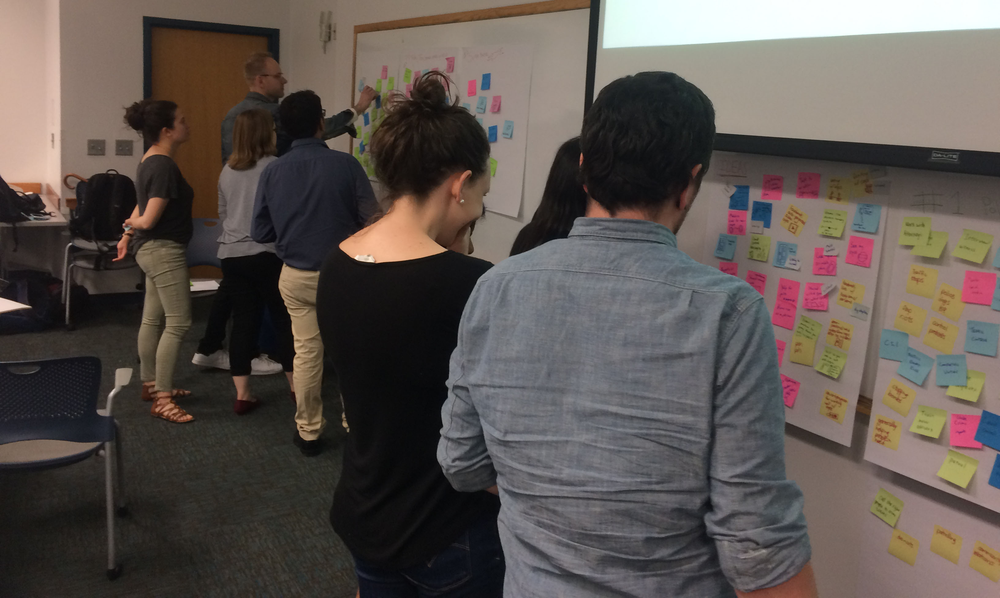
                

            

            <!--

-->
            
We split out into two groups, each brainstorming ideas around a different design direction.

        

        

            

                

                    <!--

-->
                    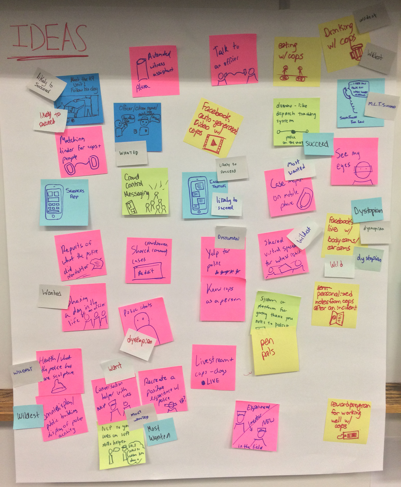
                
  
                

                    <!--

-->
                    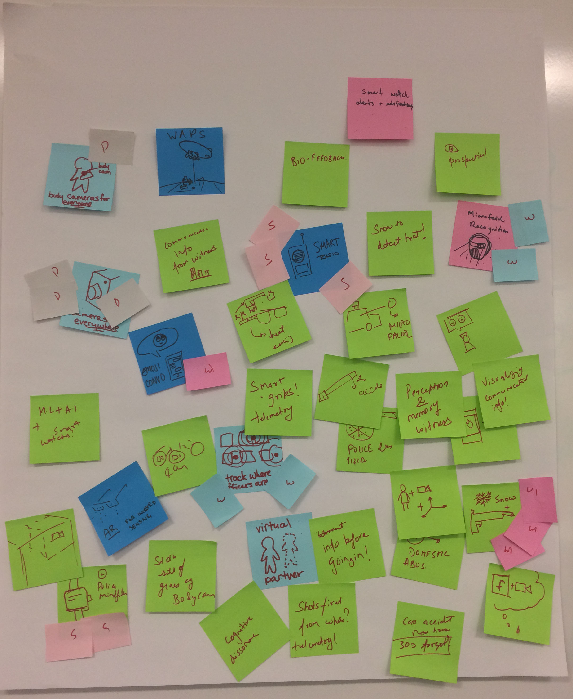
                

            

            <!-- TODO: make the height equal on these images 
                

                

-->
            
We shared the ideas from each group and voted on the ones that are the most desirable, feasible, wild, and dystopian.

        

    

    

        <h3>Storyboarding & Speed Dating</h3>
        
Having generated a wide range of designs around our two design directions, our next step was to find which ones resonated most both with law enforcement and members of the public.

        

            

                

                    <!--

-->
                    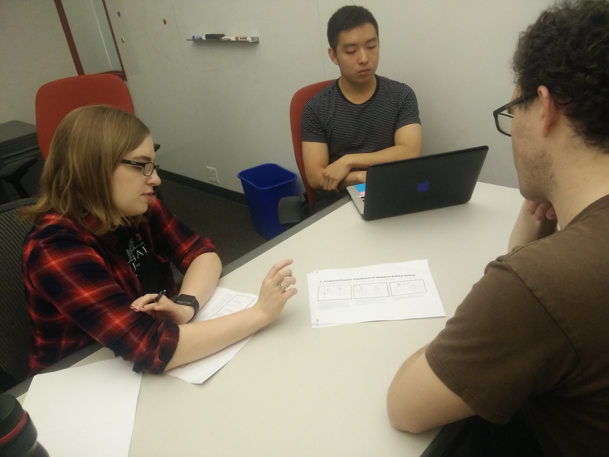
                
  
                

                    <!--

-->
                    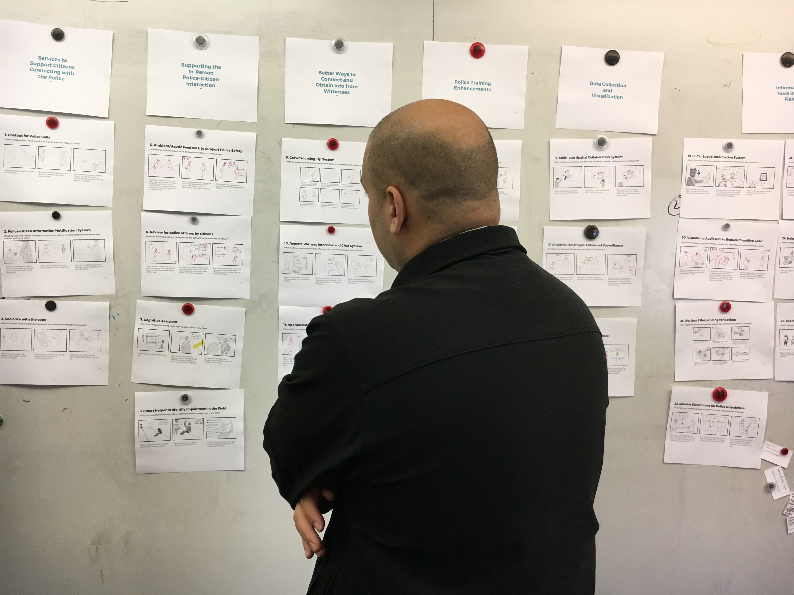
                

            <!-- TODO: make the height equal on these images 
                

                

-->
            

            
We conducted <b>speed dating</b> sessions with both members of the public and law enforcement to identify ideas that were desirable for both.

        

        

            <!--

-->
            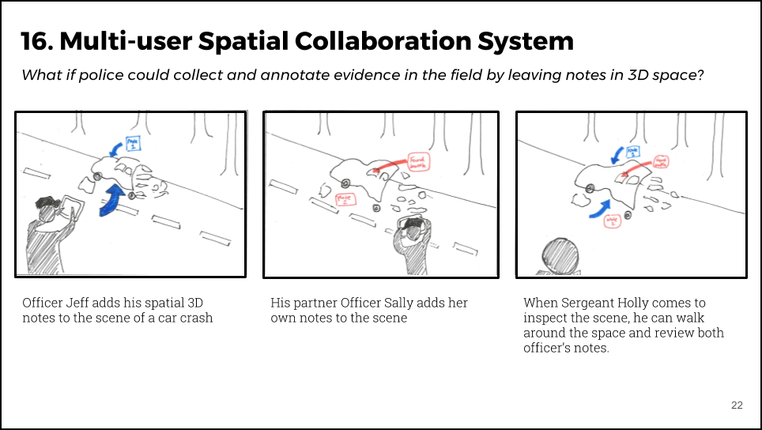
            
The idea of being able to <b>capture case information</b> in a <b>collaborative digital format</b> strongly resonated with both federal and local law enforcement.

        

    

    

        <h3>Ride-Alongs</h3>
        
To get a better understanding of how law enforcement captures information on the scene today, we participated in ride-alongs with the Pittsburgh Police.

        

            

            <!-- TODO: make the height equal on these images -->
                

                    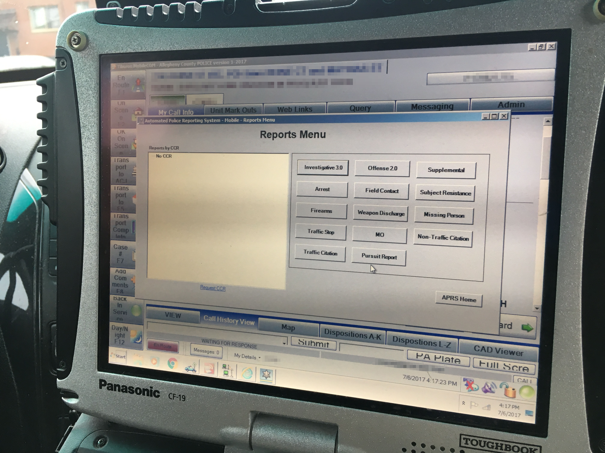
                

                

                    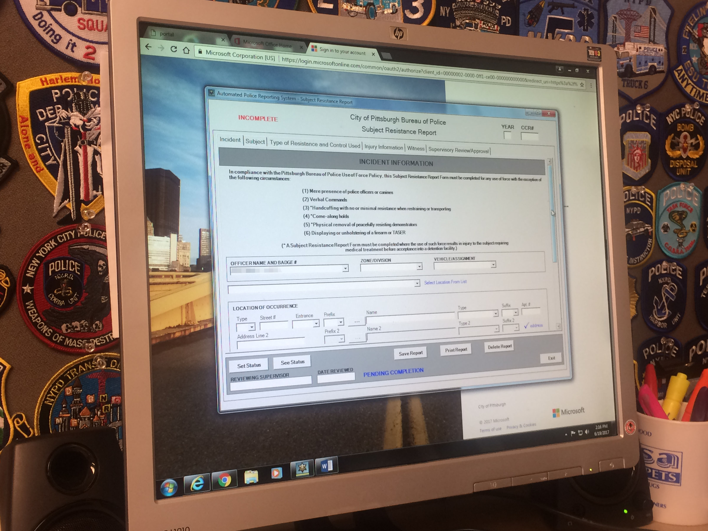
                

            

            
Officers spend a significant amount of time filling out paperwork for incidents. This requires them to fill out information they have already recorded in their notebooks.

        

        

            

            <!-- TODO: make the height equal on these images -->
                

                    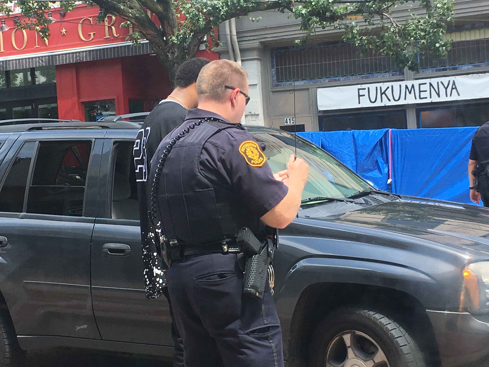
                

                

                    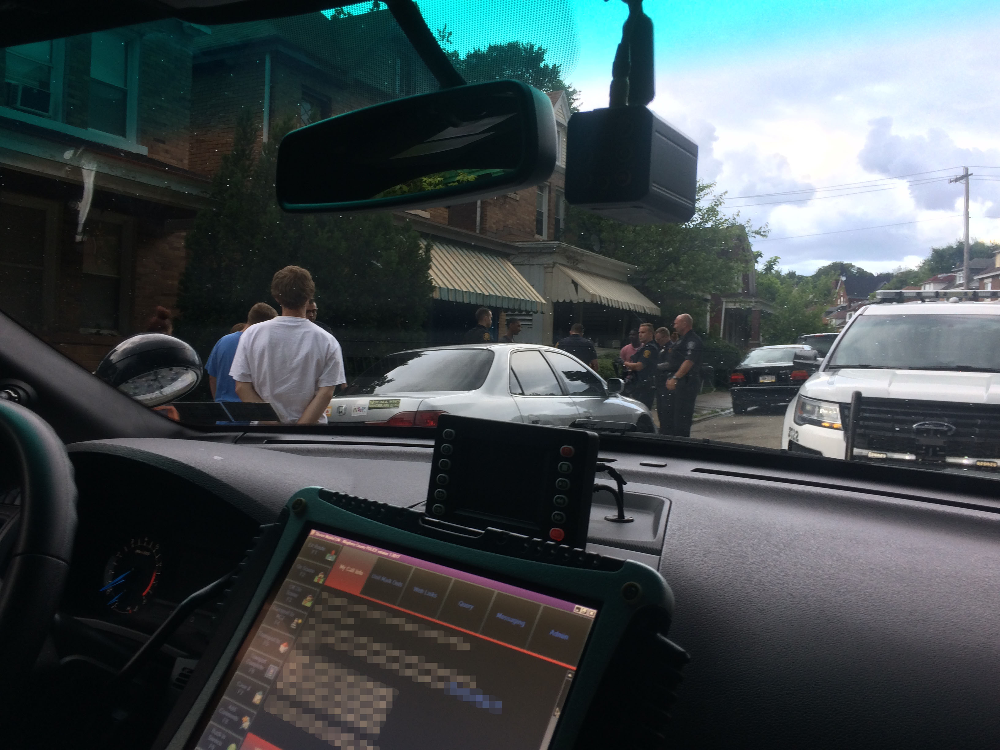
                

            

            
Most officers we observed used a small notepad to capture information on the scene.

        

        

            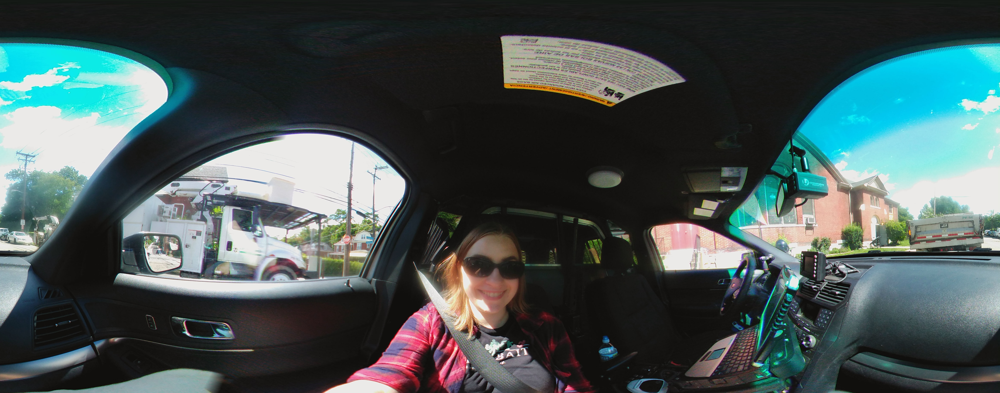
            
Fun fact: I spent 15 hours riding along with patrol officers across 2 different policing zones in Pittsburgh. I also got to eat Mexican food with patrol officers… twice.

        

    

    

        <h3>Guiding Design Principles</h3>
        
Based on all of the research and feedback we received, we developed five principles to guide the design of our application (or any other application for law enforcement).

        

            

                <h4 class="centered-text">A SOLUTION FOR POLICE SHOULD…</h4>
                <h5>1 – Support maximum flexibility</h5>
                
Officers have highly variable approaches and techniques for capturing information at a scene. To be successfully adopted, a solution should enable officers to capture information in a way that makes sense to them.

                <h5>2 – Continue to support the current way of working</h5>
                
Officers already have their techniques and methods for capturing and remembering scene information. For a solution to be successful, it should enable officers to do the same things they can do today (e.g. write down information).

                <h5>3 – Prioritize speed and simplicity</h5>
                
When officers arrive at the scene, they need to quickly collect information in a highly chaotic environment. A solution should enable them to capture better information without distracting them.

                <h5>4 – Support mobility and portability</h5>
                
Because situations that they respond to are unpredictable and could escalate dangerously, officers need gear that enables them to be mobile and have their hands free. We chose to make Vivid a mobile application for this reason: phones are small and as easy to carry around as a notepad.

                <h5>5 – Be durable</h5>
                
Both the hardware and software should be robust. For hardware, this means that it should not break if an officer suddenly needs to drop it. For software, this means that it should have redundancies in place to prevent errors or information loss.

            

        

    

    

        <h3>Design Iterations & Validation</h3>
        
In parallel with our summer research, we designed and prototyped a mobile information capture system.

        

            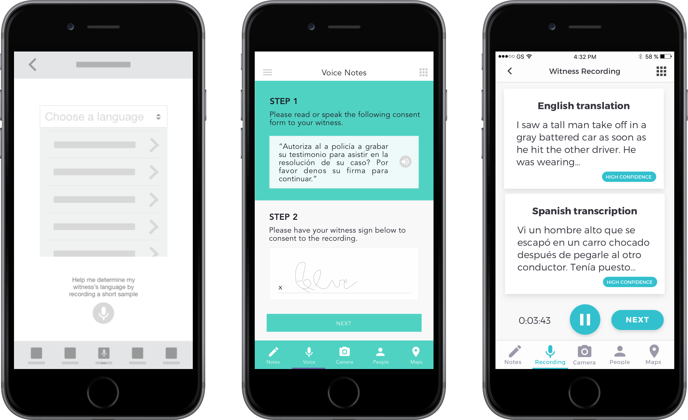
            
We went from low-fidelity wireframes all the way to a high-fidelity prototype.

        

        

            

                

                    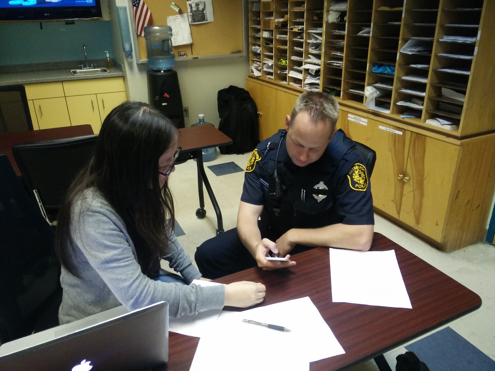
                

                

                    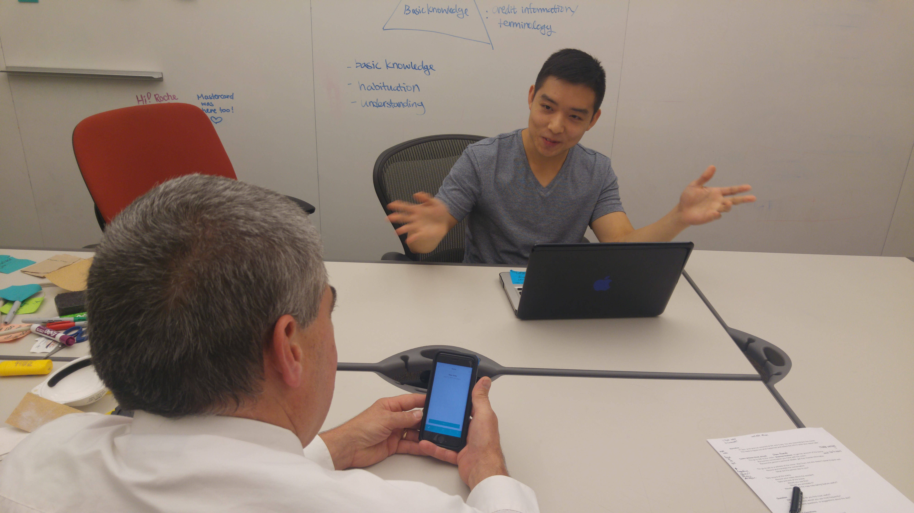
                

            

            
We tested with both patrol officers and detectives. Detectives saw value in the collaborative features while patrol officers emphasized the need for quick access to features.

        

    

